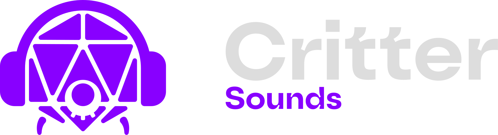
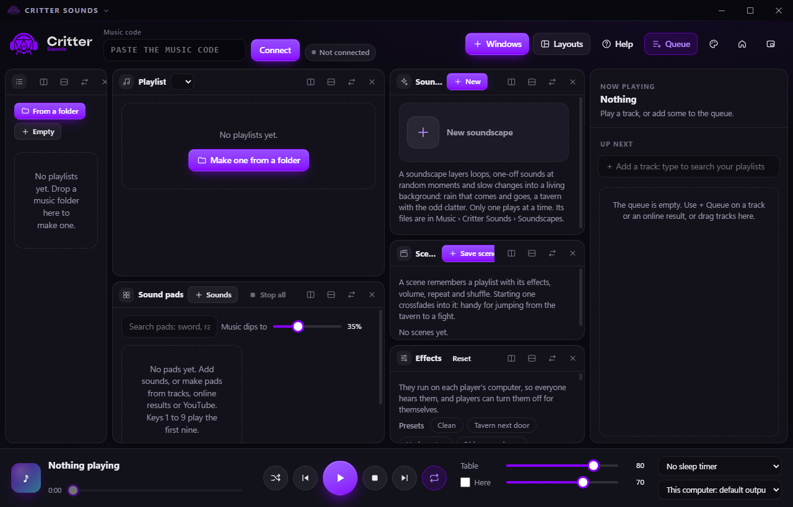

<p align="center">
  
</p>

<p align="center"><b>Music, sound effects and ambience for your tabletop game, played live to the table.</b></p>

<p align="center">
  <a href="https://github.com/booskers/critter-sounds/releases/latest">Download for Windows</a> ·
  <a href="https://booskers.github.io/critter-sounds/">Website</a> ·
  <a href="https://booskers.github.io/critter/">Critter</a>
</p>



Critter Sounds is a Windows app for whoever runs the music at a [Critter](https://booskers.github.io/critter/) table. It plays from your computer and streams to every player over WebRTC, so there's nothing to upload and no limit on tracks. It can also play into a Discord or Fluxer voice channel.

- **Playlists** from your folders, a queue, fades and crossfades.
- **Sound pads** with automatic icons and tags; keys 1 to 9 play them.
- **Soundscapes:** a node editor for living backgrounds, rendered to seamless loops.
- **Effects** such as Tavern next door, Underwater and Cave, applied on each player's side.
- **Online library:** Tabletop Audio, Incompetech, Openverse and Freesound, each credited.
- **Discord and Fluxer bots** that play the same mix in a voice channel.

## Getting started

1. Download and run **Critter Sounds Setup** from [Releases](https://github.com/booskers/critter-sounds/releases/latest).
2. In Critter, the lobby owner opens **Music** in the bottom bar and copies the table's music code.
3. Paste it into Critter Sounds and press **Connect**.

The installer isn't code-signed yet, so Windows SmartScreen may warn the first time: choose **More info › Run anyway**.

## Building it yourself

You need [Node.js](https://nodejs.org) 20 or newer, on Windows.

```bash
npm install
npm start
```

`npm run dist` builds the installer into `dist/`.

| Folder | What it is |
|---|---|
| `main.js`, `preload.js` | The Electron app: windows, files, YouTube (yt-dlp), the online library and the bots. |
| `src/` | The player page, the soundscape engine (`scape.js`) and its editor. |
| `bots/` | The Discord and Fluxer voice bots, run in a utility process. |
| `nodes-guide/` | The guide and an example for writing your own soundscape nodes. |
| `shared/` | Code that comes from [Critter](https://github.com/booskers/critter): the music effects and the Homebase client. |
| `docs/` | This project's website (GitHub Pages). |

**Shared with Critter:** the music effects (`shared/musicfx.js`) are the `MUSICFX` block of Critter's `critboard.html`, so the table and the app always sound the same. When this folder sits inside a Critter checkout (`critboard-desktop/music`), every build refreshes `shared/` from Critter's sources. On its own, it builds from the copies in `shared/`.

**Homebase:** the app connects to the Homebase in `shared/homebase.config.json`. Set `HOMEBASE_SERVER=<url>` for a build that uses another one.

The technical notes (streaming, effects, soundscapes, bots) are in Critter's [README](https://github.com/booskers/critter/blob/main/critboard-desktop/README.md#critter-sounds-the-desktop-music-player).

## License

[MIT](LICENSE): use, change and share it freely, as long as you keep the copyright notice and give credit. Pad icons come from [game-icons.net](https://game-icons.net) (CC BY 3.0), and library tracks keep their own licenses.
